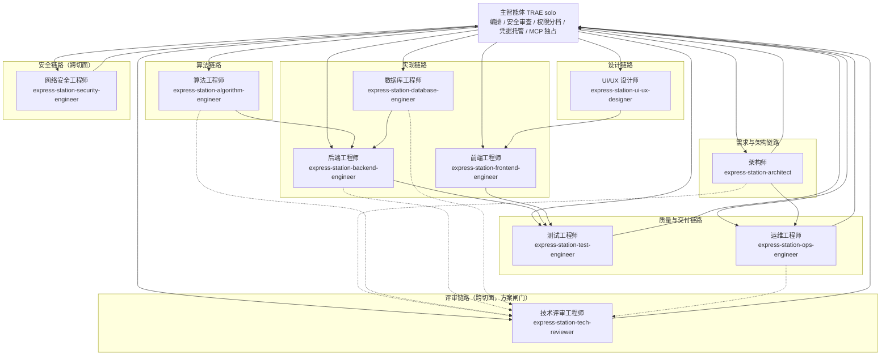

# 快递驿站智汇系统 · 智能体团队编制与调用逻辑设计

> 版本 v1.2 | 日期 2026-09-25 | 作者：架构师 `express-station-architect`
> 权威规范：`.trae/rules/项目规则1.md` v2.4。本文条款号一律以其为准；本文与规则冲突时**以规则为准**，冲突点登记在 §10。
> **常驻生效的调度规则见 `.trae/rules/智能体调度规则.md`（v1.1）；本文为论证与契约卡详设**（路由表/链路/优先级/交接包/冲突裁决/反模式的操作版以该常驻文件为准，论证、契约卡与产物台账留本文）。
> 用途：定义团队编制、职责边界、带类型产物交接与精细调用逻辑。操作版（在 TRAE 界面创建智能体的可复制文本）见 `智能体配置.md`；边界与调用逻辑**以本文为准**。
> 参照基线：MetaGPT（GitHub 69K+ stars，论文 arXiv:2308.00352，ICLR 2024 Oral）。
> **v1.2 修订（本次）：** 新增第 10 角色「技术评审工程师」（编制 1 + 10，§3.4）；新增**方案报审硬性闸门**——所有方案须经技术评审评估通过（通过 / 有条件通过）才能报主智能体审批（§4.10、§6.3 L8）；新增领域技能 `tech-evaluation`；与 `项目规则1.md` v2.4 §8 第 8 条同源。
> **v1.1 修订：** 新增第 9 角色「网络安全工程师」（编制 1 + 9）；主智能体不得无脑审批（审批纪律）；「视觉走查」正式划归 UI/UX 设计师；调度逻辑迁入 `.trae/rules/智能体调度规则.md`（本文保留论证与契约卡）。

---

## 0. 结论先行

1. 团队编制 = **1 主智能体（编排者）+ 10 角色智能体**，与项目规则 §8 逐条对齐。
2. 交接靠**带类型的产物 + 落盘路径**，不靠自由对话；触发靠**主智能体按路由表显式派发**，不做角色自动订阅（本项目是人在环，主智能体须先过 §10 权限分档）。
3. 抑制三类失效：幻觉级联（链路上设门禁与打回，§6.3/§6.7）、责任重叠与缺漏（每角色「唯一职责域 + 明确不做」，§4）、跨会话丢上下文与重复劳动（`SESSION-STATE.md` 检查点 + 渐进式加载，§6.7）。
4. 角色边界存在两类**真实缺口**（安全技术评估缺独立方、方案技术质量缺独立评估方）；v1.1 新增第 9 角色**网络安全工程师**（§3.3），v1.2 新增第 10 角色**技术评审工程师**（§3.4），其余缺口仍以 `TODO(扩展)` 登记。

---

## 1. 设计目标与非目标

### 1.1 目标（要解决什么）

| # | 问题 | 本项目已知证据 | 对应设计 |
| --- | --- | --- | --- |
| G1 | 幻觉级联：一个角色的错误输出向下游传播 | SESSION-STATE M10 曾出现「任务描述与实测 3 处出入」，文档结论被实测推翻 | 链路门禁 + 打回条件（§6.3）；产物必须带证据（§6.6） |
| G2 | 责任重叠与缺漏：角色定义模糊导致设计判断在实现阶段被覆盖 | `智能体配置.md` 原文仅「职责+规则+参考」三行，**无边界、无调用逻辑** | 唯一职责域 + 明确不做（§4）；冲突裁决表（§6.8） |
| G3 | 跨会话丢上下文、重复劳动 | 长任务跨会话（一期→二期→三期）；多会话并发作业（SESSION-STATE「并发冲突记录」） | 检查点台账与读取顺序（§6.7）；检查表（§9） |
| G4 | 越权与安全违规 | v2.1 取消人工审批，改为 §10 三档授权；MCP 主智能体独占（§10.5） | 权限绑定（§7）；反模式清单（§8） |
| G5 | 该派不派 / 不必派乱派 | 无判据 → 要么主对话越俎代庖，要么为小改动派整条链路 | 可判定路由表（§6.1）；无需派发判据（§6.5） |

### 1.2 非目标（明确不做）

- **不做全自动无人值守流水线**：本项目为「人在环 + 主智能体编排」，用户是口径（计费/提成/SLA/考核）的最终裁定者（§11.4），
  关键决策不接受自动拍板。
- **不引入外部多智能体编排框架**（CrewAI / LangGraph / AutoGen 等）：编排由 TRAE solo 主智能体承担，见 §2「差异与理由」。
- **不改变 §10 权限三档**：本文只描述三档如何作用到「主智能体 → 角色智能体」链路（§7），不新增档位、不放宽禁止项。
- **不改动既有 8 个角色的 `SKILL.md`**：那是下一批次（新增的网络安全工程师 `SKILL.md` 另由专项任务创建，见 §3.3）。
- **不再增编第 10 个角色**：第 9 个（网络安全工程师）已于本版新增，其余缺口仍以 `TODO(扩展)` 登记（§3.3）。

---

## 2. 参照基准与借鉴点映射表

MetaGPT 核心命题 `Code = SOP(Team)`：把人类软件组织的标准作业程序编码进多智能体系统，把流程分解为固定角色，每角色有「输入产物 → 输出产物 → 对应 SOP」（ProductManager → PRD；Architect → 系统设计书 + API 接口定义；ProjectManager → 任务分解清单；Engineer → 实现代码；QAEngineer → 测试用例与执行结果）。
来源：MetaGPT，arXiv:2308.00352 / GitHub 69K+ stars。

| MetaGPT 机制（来源同上） | 本项目对应设计 | 差异与理由 |
| --- | --- | --- |
| 固定角色 + SOP（`Code = SOP(Team)`） | 9 角色 + 主智能体编排，角色清单由 §8 固定 | 本项目 SOP 落在项目规则 §8/§9/§10/§11，不落在框架代码里；且是人在环，不是端到端自动生成整套软件 |
| 带类型产物交接（typed artifacts）：每角色订阅上游特定 Action 输出作为触发（`_watch`） | 产物契约台账（§5）：每角色输入 = 上游产物路径；触发由主智能体按路由表判断后**显式派发** | 不做角色自动订阅。原因：派发前主智能体必须先做 §10 权限分档、§7 凭据分档与安全检查，这一步无法由下游角色自行触发 |
| 共享消息池（Environment / 消息代理），产物对相关角色可见、不相关角色不接收（订阅过滤） | 共享池 = 仓库文件系统（`SESSION-STATE.md` + `hrm-dev/docs/**`）+ 主智能体转达；可见性靠「交接包只给必要上下文」（§6.6） | 本项目用文件做共享池（long-task-optimizer 原则「上下文堆文件里，不堆对话里」），不引入进程内消息代理；过滤由主智能体人工控制，避免角色读到无关上下文 |
| `ProjectRepo`（Git 支撑的存储） | Git（Gitee 主 / GitHub 备份）+ 分支纪律 §2 | 保留，产物进 Git；但生产源码只走 `feature → dev → main`，**AI 不得直提 `main`**（§10.4） |
| 设计动机：抑制 hallucination cascades | 链路门禁 + 一次打回 → 重派 → 接管（§6.3/§6.7）；产物必须带证据（§6.6） | 同源动机；本项目额外用「反幻觉核心原则 + 条款号必须写对」约束（项目规则核心原则 1） |
| 设计动机：抑制责任重叠与缺漏 | 每角色「唯一职责域 + 明确不做」（§4）+ 冲突裁决表（§6.8） | 同源动机；本项目额外用「升级路径」强制停下回报，避免角色自行拍板越界 |
| `Team` 组装 `Role`，角色由基类派生并绑定 `Action`，可组合扩展 | 编制固定 9 角色，扩展只能以 `TODO(扩展)` 提出（§3.3） | 本项目角色边界由工程矩阵（§1.1）与技能矩阵（§9）锁定，防止角色膨胀导致责任稀释 |

**对照说明（一笔带过，不展开）**：CrewAI、LangGraph、AutoGen 亦提供角色编排，但本项目不采用，理由同上——编排、安全检查与授权必须由主智能体独占（§8、§10.5）。

---

## 3. 团队编制图

### 3.1 编制总览（1 + 10）

| 层 | 角色 | Agent 标识 | 职责域一句话 |
| --- | --- | --- | --- |
| 编排 | 主智能体（TRAE solo，无需创建） | — | 需求拆解、编排调度、安全审查、Review 把关、权限分档、凭据托管、MCP 独占 |
| 需求与架构 | 架构师 | `express-station-architect` | 架构设计、技术选型、模块划分、接口与数据库顶层设计、方案评审、ADR |
| 实现 | 后端工程师 | `express-station-backend-engineer` | 后端接口、业务逻辑、数据同步、采集端（Python）、外部对接 |
| 实现 | 算法工程师 | `express-station-algorithm-engineer` | 算法、调度/排班/路径优化、预测统计、限速与容量建模、评分与计费口径 |
| 设计 | UI/UX 设计师 | `express-station-ui-ux-designer` | UI/UX 设计、设计系统、Design Tokens、响应式、视觉走查 |
| 实现 | 前端工程师 | `express-station-frontend-engineer` | 前端 / Vue / Demo / H5 / 安卓壳页面实现 |
| 实现 | 数据库工程师 | `express-station-database-engineer` | 建表、SQL、Flyway 迁移、索引优化、数据规范 |
| 质量与交付 | 测试工程师 | `express-station-test-engineer` | 用例设计、单元/接口/E2E、Bug 复现与验证 |
| 质量与交付 | 运维工程师 | `express-station-ops-engineer` | 部署、CI/CD、宝塔/Nginx、监控、回滚 |
| 安全 | 网络安全工程师（第 9 角色） | `express-station-security-engineer` | 安全威胁建模、代码与配置安全审计、依赖与供应链漏洞核查、安全测试与攻击面验证、安全合规红线技术判定 |
| 评审 | 技术评审工程师（第 10 角色，v1.2 新增） | `express-station-tech-reviewer` | **方案阶段产物技术质量独立评估**（依据充分性、边界合理性、NFR 覆盖、复杂度论证、假设与风险登记、既有契约一致性） |

### 3.2 编制图（主智能体居中，角色按链路分组）

图读法：**所有派发与回报都经主智能体**（实线进出 MA）；`UX → FE`、`AL → BE`、`DB → BE`、`BE/FE → QA`、`AR → OPS` 表示**产物依赖方向**（上游产物是下游输入），不是「角色之间可直接对话」。角色之间不直连（§7）。`MA ⇄ SEC` 为**跨切面安全评估链**：SEC 出技术结论（威胁建模 / 审计 / 风险分级）并回报 MA，结论供 MA 在 C 档授权时决策使用；**SEC 只出结论，不出审批**（§7、§10.3）。`MA ⇄ TR` 为**跨切面方案闸门链**：虚线 `方案产出角色 ⇢ TR` 表示**方案阶段产物交技术评审评估**（评估方非产出方），TR 出结论等级（通过 / 有条件通过 / 打回）并回报 MA；**结论为「打回」不得报审**；**TR 只出结论与必改项，不出审批、不代改方案**（§4.10、§6.3 L8）。

### 3.3 为什么新增网络安全工程师（第 9 角色）

- **根因：评估与审批压在同一个主体**。原 8 角色设计里，「安全技术评估」与「安全审批」都落在主智能体一身。同一主体既当裁判又当运动员，缺少独立的技术评估方，正是「无脑审批」风险的根因（原目标 G4「越权与安全违规」）。v2.1 已取消人工审批、改为 §10.3 主智能体三步授权，该风险被进一步放大。
- **拆分后各归其位**：主智能体 = **决策与授权方**（§10.3）；网络安全工程师 = **技术评估方** —— 只出威胁建模 / 审计 / 风险分级 / 复现步骤 / 修复建议与验收标准，**不出审批**（见 §4.9）。二者分离，不得由同一主体兼任（项目规则 §8 审批纪律）。
- **为什么必须独立成角色而非留在主智能体**：评估需要专业的攻击面视角与可复现证据（发现项含严重级 / 可利用性 / 影响面 / 复现步骤），与主智能体的编排、Review、授权职责正交；且安全评估须横切 `hrm-server` 源码与依赖、`deploy/**` 与 Nginx 配置、`collector-architecture-adr.md` §20 与 `wecom-integration-adr.md` 合规红线等，工作量与专业度已超出主智能体单一职责。
- **范围收敛，不扩散**：新增的仅是**安全技术评估**这一域，**现有 8 域均不调整**（采集端 Python 与外部对接仍归后端；需求与产品决策仍归主智能体 + 用户，故不设「产品经理」；采集合规仍走「人工已登录会话 + CDP 旁路只读」（§7.2.5），不设「爬虫工程师」）。
- **其余真实缺口仍只登记，不得擅自增编**：
  - `TODO(扩展):` 若三期企微（`hrm-dev/docs/wecom-integration-adr.md`）工作量大到超出后端单角色承载，评估增设「企微对接工程师」，须先修订 §8。
  - `TODO(扩展):` 若二期采集端 20 万级数据运维增长到需要独立数据管道（§11.2「容量与性能建模」），评估增设「数据工程师」。

### 3.4 为什么新增技术评审工程师（第 10 角色）

- **根因：方案产出与方案评审压在同一个主体**。原设计中，「方案产出」与「方案评审」都由**架构师**承担——架构师既写 ADR / 架构设计（产出），又出架构评审报告 `review-{主题}.md`（评审）。同一主体既当运动员又当裁判，**评估方与产出方未分离**。这与 v1.1 新增网络安全工程师所修的根因（评估与审批压在同一个主体）**同构**，只是从「安全面」换成了「工程面」。
- **拆分后各归其位**：方案产出方 = 架构师 / 算法工程师 / 后端工程师 / 数据库工程师 / 运维工程师；**评估方 = 技术评审工程师**（只评方案阶段产物的技术质量，不产出方案）；决策与授权方 = 主智能体（§10.3）。三者分离，不得由同一主体兼任。
- **为什么必须独立成角色而非留在架构师**：方案技术质量评估需要跨角色的独立视角——既评架构师的 ADR，也评算法的四件套、后端的接口契约、数据库的设计、运维的部署方案；若留在架构师，则「评自己 + 评他人」并存，独立性不成立。且评估工作横切 §11.3 四件套门禁、§6 数据库规范、§5 部署回滚、§12 演示隔离约束等，工作量与专业度已超出架构师单一职责。
- **闸门强度（用户 2026-09-25 明确）**：**所有方案必须经技术评审工程师评估通过（结论「通过」或「有条件通过」）后，才能报主智能体审批**；结论为「打回」的方案**不得报审**，须退回原作者修订后重评；未过闸门的方案主智能体**不得受理**。此闸门写入 `项目规则1.md` §8 第 8 条与调度规则 P0.6 / L8。
- **范围收敛，不扩散**：新增的仅是**方案阶段技术质量评估**这一域；现有 10 域均不调整。技术评审评「工程面」，网络安全工程师评「安全面」，主智能体做「操作安全评估」与授权——**三类评估并行不互替**（§6.8 冲突裁决表）。
- **明确不做（独立性根基）**：① 不产出方案（不写 ADR / 四件套 / 接口 / 表结构 / 部署方案）；② 不做安全实质判定（网络安全工程师）；③ 不做功能 / 接口 / E2E 验证与门禁实跑（测试工程师）；④ 不做视觉走查（UI/UX）；⑤ 不裁定业务口径（用户）；⑥ 不做操作安全评估与 C 档授权（主智能体）；⑦ 不写修复代码 / 不代改方案（只出「必改项 + 验收标准」交原作者）；⑧ 不调用 MCP。
- **其余真实缺口仍只登记，不得擅自增编**：
  - `TODO(扩展):` 若三期企微（`hrm-dev/docs/wecom-integration-adr.md`）工作量大到超出后端单角色承载，评估增设「企微对接工程师」，须先修订 §8。
  - `TODO(扩展):` 若二期采集端 20 万级数据运维增长到需要独立数据管道（§11.2「容量与性能建模」），评估增设「数据工程师」。

---

## 4. 角色职责契约卡（10 张）

> 卡片字段固定。**加载技能**与项目规则 §9 技能矩阵逐字一致（领域技能对应 §9.2，通用强制技能对应 §9.1），不得增删。

### 4.1 架构师 · `express-station-architect`

| 字段 | 内容 |
| --- | --- |
| 唯一职责域 | 只对**分层、模块边界、技术选型、接口与数据库顶层设计、ADR 决策记录**负责 |
| 明确不做 | ① 不写业务实现代码（Controller/Service/Mapper/Vue 组件/Flyway 脚本），落地交后端/前端/数据库；② 不做 §11.1 算法场景的建模与选型定案（交算法工程师），只评审方案与系统契合度；③ 不执行任何部署/服务器操作、不调用 MCP（§10.5）；④ 不定义计费/提成/SLA/考核口径（§11.4 须用户确认） |
| 上游输入 | 需求文档（`hrm-dev/docs/requirement.md`）、迭代规划（`hrm-dev/docs/plan.md`）、任务清单（`hrm-dev/TASK.md`）、用户口径裁定 |
| 下游输出 | 架构设计文档与 ADR（`hrm-dev/docs/adr-{序号}-{标题}.md`；域级 ADR 沿用 `hrm-dev/docs/collector-architecture-adr.md`、`hrm-dev/docs/wecom-integration-adr.md`）、接口契约（写入 `hrm-dev/docs/api.md` 供后端定稿）、架构评审报告（`hrm-dev/docs/review-{主题}.md`） |
| 禁止事项 | 不得把真实凭据/服务器 IP/业务数据写入文档（§7.2.1 §10.4）；不得输出无源结论（反幻觉核心原则 1）；不得越权拍板口径（§11.4） |
| 升级路径 | 方案涉及 C 档动作（结构变更、合并 `main`、打 tag）、涉及口径变更、设计判断与既有产物（`api.md`/`db.md`）冲突时，**停下回报主智能体** |
| 加载技能 | `token-optimizer`、`engineering-discipline`、`long-task-optimizer`、`system-architecture` |

### 4.2 后端工程师 · `express-station-backend-engineer`

| 字段 | 内容 |
| --- | --- |
| 唯一职责域 | 只对**接口实现、业务逻辑、数据同步、外部对接、采集端（Python）**负责 |
| 明确不做 | ① 不设计表结构与索引（数据库工程师）；发现需改表须提变更清单交数据库工程师，不自行写 DDL；② 不做算法建模与选型（算法工程师），只按算法方案落地实现（§8.2）；③ 不做 UI 视觉/交互与 Design Tokens（UI/UX 设计师）；④ 不写前端页面（前端工程师）；⑤ 不执行部署、Nginx/宝塔操作、不调用 MCP（§10.5）；⑥ 不自行确定计费/提成/SLA 口径（§11.4） |
| 上游输入 | 接口契约（`hrm-dev/docs/api.md`）、数据库设计（`hrm-dev/docs/db.md`）、算法方案（`hrm-dev/docs/algo-{主题}.md`）、测试用例（`hrm-dev/docs/test-cases.md`，TDD 先行） |
| 下游输出 | 后端源码（`hrm-dev/hrm-server/**`）、采集端源码、接口契约更新（`hrm-dev/docs/api.md`）、变更日志条目（`hrm-dev/docs/update-log.md`） |
| 禁止事项 | SQL 一律参数化、禁止拼接（全局规则 §4）；密钥不硬编码（§7.2.1）；不得在服务器直接改源码（§10.4）；`TODO(扩展)` 才可预留代码（核心原则 4） |
| 升级路径 | 需要改表结构、需要新凭据/第三方密钥、接口契约需变更、命中 §11.1 算法场景，**停下回报主智能体** |
| 加载技能 | `token-optimizer`、`engineering-discipline`、`tdd-development`、`long-task-optimizer`、`spring-boot-expert` |

### 4.3 算法工程师 · `express-station-algorithm-engineer`

| 字段 | 内容 |
| --- | --- |
| 唯一职责域 | 只对**算法建模、选型与复杂度论证、离线可复现实现与基准、阈值/权重的可配设计**负责（覆盖 §11.1 全部触发场景） |
| 明确不做 | ① 不落地生产接口/Controller/数据库迁移（后端、数据库工程师）；② 不改前端展示逻辑（前端工程师）、不改表结构（数据库工程师）；③ 不擅自变更计费/提成/SLA/考核口径（§11.4 必须先经用户确认）；④ 不硬编码阈值/权重（§11.4 参数外置可配）；⑤ 不执行部署、不调用 MCP（§10.5） |
| 上游输入 | 需求文档（`hrm-dev/docs/requirement.md`）、接口契约（`hrm-dev/docs/api.md`）、数据库设计（`hrm-dev/docs/db.md`）、用户口径裁定 |
| 下游输出 | **算法交付四件套**（§11.3：① 问题建模 ② 算法选型与复杂度 ③ 依据来源 ④ 可验证指标与基准数据）→ `hrm-dev/docs/algo-{主题}.md`；离线可复现实现（纯函数 + 单测，固定随机种子）；基准数据与复现脚本（`TODO(扩展):` 独立数据集与脚本目录待定，当前内嵌于 `algo-*.md`） |
| 禁止事项 | 不得凭记忆臆断，须注明官方文档/论文/开源来源（§11.3-③）；不得省略「四件套」任一项；基准数据不得含真实业务数据（§6.6 §7.1）；不得阻塞主流程——算法不可用须给规则兜底（§11.4 失败降级） |
| 升级路径 | 命中口径红线（§11.4）、四件套无法齐备、性能曲线劣化需登记 `TODO(扩展)`、算法与既有口径（`api.md`/`db.md`）冲突时，**停下回报主智能体** |
| 加载技能 | `token-optimizer`、`engineering-discipline`、`algorithm-optimization` |

### 4.4 UI/UX 设计师 · `express-station-ui-ux-designer`

| 字段 | 内容 |
| --- | --- |
| 唯一职责域 | 只对**设计方向、设计系统与 Design Tokens、视觉/交互规范、响应式与可访问性、视觉走查（已裁定正式归本方，见 §10）**负责 |
| 明确不做 | ① 不写 Vue 组件实现、不改 `src/**` 业务代码（前端工程师按 Tokens 实现，§8.1）；② 不做接口契约与数据结构（后端工程师）；③ 不改 Mock 数据结构、不迁就断言（测试工程师；参照 SESSION-STATE「不为 lint 改写验收资产」先例）；④ 不决定算法口径与排班规则（算法工程师）；⑤ 不执行部署、不调用 MCP（§10.5） |
| 上游输入 | 需求文档（`hrm-dev/docs/requirement.md`）、架构设计/ADR（`hrm-dev/docs/adr-*.md`）、Demo 既有设计规范（`hrm-dev/docs/demo-ui-redesign.md`、`hrm-dev/docs/demo-ux-improvement.md`、`hrm-dev/docs/demo-staff-ui-redesign.md`、`hrm-dev/docs/demo-boss-ui-spec.md`） |
| 下游输出 | 设计规范与 Design Tokens（`hrm-dev/docs/ui-spec-{主题}.md`；Tokens 落前端工程，`TODO(扩展):` 具体路径以实际工程为准）、Demo 设计规范（`hrm-dev/docs/demo-*.md`）、视觉走查报告（`hrm-dev/docs/review-{主题}.md`，**走查结论由本方出**，测试不重复承担） |
| 禁止事项 | 不得引入二进制图片资源以外的违规素材（参照 SESSION-STATE「favicon 内联 SVG，不引二进制」先例登记）；对比度须 ≥ 4.5:1、触控区 ≥ 44px（本方 SKILL.md 基线）；不得绕过设计直接让前端定视觉（§8.1） |
| 升级路径 | 设计方向与需求冲突、需改 `hrm-admin`/`hrm-server` 源码才可实现、走查发现「待真机复核」类无法闭环项时，**停下回报主智能体** |
| 加载技能 | `token-optimizer`、`engineering-discipline`、`ui-ux-design` |

### 4.5 前端工程师 · `express-station-frontend-engineer`

| 字段 | 内容 |
| --- | --- |
| 唯一职责域 | 只对**前端页面与组件实现、路由与状态、H5 壳页面、按设计规范还原**负责 |
| 明确不做 | ① 不新增/改表结构与 SQL（数据库工程师）；② 不定视觉方向与 Tokens（UI/UX 先行，§8.1）；③ **不改 `hrm-dev/hrm-admin` 与 `hrm-dev/hrm-server`**（§12.1，Demo 只经 `@admin` 只读引用）、不改 Mock 层装配规则与 `VITE_MOCK_ENABLED` 开关语义（§12.3 §12.4）；④ 不实现后端业务逻辑与接口（后端工程师）；⑤ 不定义算法口径（算法工程师） |
| 上游输入 | 设计规范与 Tokens（`hrm-dev/docs/ui-spec-{主题}.md`、`hrm-dev/docs/demo-*.md`）、接口契约（`hrm-dev/docs/api.md`）、测试用例（`hrm-dev/docs/test-cases.md`） |
| 下游输出 | 前端源码（`hrm-dev/hrm-admin/src/**`、`hrm-dev/hrm-demo/**`、安卓壳页面）、变更日志条目（`hrm-dev/docs/update-log.md`） |
| 禁止事项 | 不得复制一期源码进 Demo（§12.1）；不得直连假后端（§12.3）；演示/隔离工程改动不得混入生产工程（§2 纪律 1）；生产构建 `*.map` 不得公开（§10.4） |
| 升级路径 | 设计规范缺失或自相矛盾、需改 `hrm-admin`/`hrm-server`、需改 Mock 契约/断言、命中 §11.1 前端侧算法逻辑时，**停下回报主智能体** |
| 加载技能 | `token-optimizer`、`engineering-discipline`、`vue-expert` |

### 4.6 数据库工程师 · `express-station-database-engineer`

| 字段 | 内容 |
| --- | --- |
| 唯一职责域 | 只对**表结构设计、DDL、Flyway 迁移脚本、索引实现、数据规范（单 MySQL）**负责 |
| 明确不做 | ① 不写后端业务逻辑与接口（后端工程师）；② 不做容量/查询性能的建模与阈值定案（算法工程师，§11.1「容量与性能建模」），只按模型实现索引；③ **不执行/修复 Flyway 迁移**（执行属 C 档，主智能体授权，§10.3）；④ 不写入真实业务数据（§6.6 §7.1）；⑤ 不改 PostgreSQL 冻结脚本（§6.3） |
| 上游输入 | 架构设计/数据库顶层设计（`hrm-dev/docs/adr-*.md`）、后端变更清单、算法容量模型（`hrm-dev/docs/algo-{主题}.md`） |
| 下游输出 | 结构快照与迁移脚本（`hrm-dev/sql/schema/mysql/init.sql`、`hrm-dev/hrm-server/src/main/resources/db/migration/mysql/V{n}__描述.sql`）、数据库设计文档（`hrm-dev/docs/db.md`）、变更日志条目（`hrm-dev/docs/update-log.md`） |
| 禁止事项 | 已执行脚本永不修改，变更写新版本号（§6.4）；禁止 `SELECT *`（§6.7）；命名须 snake_case + `idx_表名_字段`（§6.5）；大表（如 `parcel`）结构变更须数据库+算法联评（§6.8） |
| 升级路径 | 需在服务器执行迁移/结构变更、需回滚数据、大表变更需联评、脚本与 `db.md` 或既有 Flyway 版本冲突时，**停下回报主智能体** |
| 加载技能 | `token-optimizer`、`engineering-discipline`、`database-design` |

### 4.7 测试工程师 · `express-station-test-engineer`

| 字段 | 内容 |
| --- | --- |
| 唯一职责域 | 只对**用例设计、单元/接口/E2E 测试、覆盖率与门禁实跑、Bug 复现与验证、上线就绪度判定、响应式与可访问性的可执行验收**负责 |
| 明确不做 | ① 不修业务代码——发现缺陷**只复现与验证**，修复交后端/前端/数据库工程师（**边界以本方 SKILL.md 与项目规则为准**）；② 不定义验收口径/计费口径（§11.4 须用户确认）；③ 不做部署与服务器操作、不调用 MCP（§10.5）；④ 不做 UI 视觉设计，也不做**视觉走查**（归 UI/UX 设计师，§4.4；视觉走查报告由 UI/UX 出，本方只做功能/接口/E2E/门禁实跑与响应式、可访问性的可执行验收，**不重复承担视觉走查结论**）；⑤ **不为通过先改验收资产**（参照 SESSION-STATE 冻结 `verify-mock.mjs` 不改写的先例） |
| 上游输入 | 接口契约（`hrm-dev/docs/api.md`）、测试用例（`hrm-dev/docs/test-cases.md`）、设计规范（`hrm-dev/docs/ui-spec-{主题}.md`）、算法基准（`hrm-dev/docs/algo-{主题}.md`）、各实现产物 |
| 下游输出 | 测试用例与测试代码（`hrm-dev/docs/test-cases.md` + 测试源码）、Bug 复现记录（写入 `hrm-dev/docs/test-cases.md` 或 `hrm-dev/docs/review-{主题}.md`）、测试/门禁报告（`hrm-dev/docs/review-{主题}.md`、`hrm-dev/docs/demo-functional-test-report.md`）、检查点条目（`SESSION-STATE.md`） |
| 禁止事项 | 不得声称「已验证」而实为未跑（§4.1：无环境时须写「静态审查 + 收敛到 XX 阶段」）；不得弱化批次门禁基线（参照 SESSION-STATE「随批次上调，不得弱化」先例）；窄窗/单分辨率现象须标注「待真机复核」（§14.6） |
| 升级路径 | 验收失败且疑为需求/口径问题、门禁劣化无法归因、需要真机/服务器环境才能闭环时，**停下回报主智能体** |
| 加载技能 | `token-optimizer`、`tdd-development`、`qa-lifecycle` |

### 4.8 运维工程师 · `express-station-ops-engineer`

| 字段 | 内容 |
| --- | --- |
| 唯一职责域 | 只对**部署执行、CI/CD、宝塔/Nginx 配置、监控与回滚操作**负责 |
| 明确不做 | ① **不做安全评估**——**操作安全评估**（影响范围 / 是否涉生产数据 / 是否可逆 / 回滚步骤）由**主智能体**按 §10.3 完成；**技术安全评估**（漏洞 / 攻击面 / 鉴权与越权 / 依赖与供应链 / 合规红线）由**网络安全工程师**出具；运维不承担任一类（本方 SKILL.md 同款口径）；② **不直接调用 MCP**（§10.5，主智能体独占）；③ 不在服务器编辑业务源码（§5 红线 §10.4）；④ 不设计业务功能与表结构（交架构/数据库）；⑤ 不写业务代码修复缺陷（交对应工程师） |
| 上游输入 | 架构设计（`hrm-dev/docs/adr-*.md`）、部署手册（`hrm-dev/docs/deploy.md`）、发布版本/tag（§5）、**主智能体下发的 C 档授权与凭据**（§7.1 §10.3） |
| 下游输出 | 部署与回滚记录（`hrm-dev/docs/deploy.md`、`hrm-dev/docs/update-log.md`）、运维脚本（`hrm-dev/deploy/**`）、检查点条目（`SESSION-STATE.md`） |
| 禁止事项 | 服务器代码只来源于 `git pull`（§5 红线）；宝塔托管进程须带 `RESTART_MODE=bt`，不得双进程抢 8080（§5）；Nginx 四关键项不得删改（§5）；上线前先备份数据库（§5）；凭据不落明文（§7.2.1） |
| 升级路径 | 任何 C 档动作（重部署/回滚/证书/防火墙/删文件/停服务）、需凭据、健康检查失败、需在服务器新增非源码文件时，**停下回报主智能体** |
| 加载技能 | `token-optimizer`、`engineering-discipline`、`devops-pipeline` |

> **边界核实结论**：运维工程师**不承担任一类安全评估**（**操作安全评估**归**主智能体** §10.3，**技术安全评估**归**网络安全工程师** §4.9），也**不加载/接受 `code-review`**；`code-review` 按 §9.1 由主智能体在提交/合并/上线前发起。测试工程师与运维工程师的职责边界以上表与各自 `SKILL.md` 为准。

### 4.9 网络安全工程师 · `express-station-security-engineer`

| 字段 | 内容 |
| --- | --- |
| 唯一职责域 | 只对安全威胁建模、代码与配置的安全审计、依赖与供应链漏洞核查、安全测试与攻击面验证、安全合规红线的技术判定负责。 |
| 明确不做 | ① 不做审批/授权（C 档授权是主智能体职责 §10.3，本角色只出技术结论与风险等级）；② 不直接调用 MCP（§10.5）；③ 不执行部署与服务器操作（运维工程师职责）；④ 不写业务代码修复，只出修复建议与验收标准，交对应实现角色；⑤ 不获取或轮换凭据（§7.1），审计中不得读取真实凭据明文；⑥ 不做功能正确性测试与门禁实跑（测试工程师职责），只做安全维度；⑦ 不设计表结构（数据库工程师职责）；不改 Nginx / 宝塔配置，只出建议交运维；⑧ **技术安全评估的独立性**——不参与 §10.3 的**操作安全评估**与授权决策，仅出技术结论（评估与授权分离，不得由同一主体兼任）。 |
| 上游输入 | 架构设计 / ADR（`hrm-dev/docs/adr-{序号}-{标题}.md`，**新增**）、接口契约 `hrm-dev/docs/api.md`、源码与配置（只读）、依赖清单（`hrm-dev/hrm-server/pom.xml` 与前端 `package.json` / lock）、部署与 Nginx 配置 `hrm-dev/deploy/**`、合规文档（`collector-architecture-adr.md` §20、`wecom-integration-adr.md` 红线 W-C1/C3/C8/C10）、项目规则 §7.2 安全红线。 |
| 下游输出 | ① 安全评估报告 `hrm-dev/docs/security-{主题}.md`（**新增**：威胁建模 / 发现项含严重级与可利用性与影响面 / 复现步骤 / 修复建议 / 复验结论）；② C 档授权的技术输入结论（风险等级 + 是否可放行 + 缓解措施）；③ 安全测试用例（交测试工程师纳入 `hrm-dev/docs/test-cases.md`）。 |
| 硬红线 | 不得逆向接口签名、注入进程、伪装设备标识、绕过风控限频（§7.2.5、§10.4）；不得在生产库执行破坏性验证（§10.4）；报告中不得出现真实凭据明文（§7.1）；未验证项闭环前不得声称「已确认合规」（§7.2.5）；不得以「以 root 运行应用进程」为前提给出放行结论（§10.4）。 |
| 升级路径 | 发现高危可利用漏洞（尤其涉生产数据或权限绕过）、发现凭据泄露痕迹、需在生产环境做验证、发现实现与 §7.2 冲突、发现 §7.2.5 合规红线被触碰时，**立即停下回报主智能体**。 |
| 加载技能 | `token-optimizer`、`engineering-discipline`、`code-review`（领域核心，取安全维度）；附 `TODO(扩展): 待新增专用安全审计技能；当前以 code-review 的安全维度承担`。 |

### 4.10 技术评审工程师 · `express-station-tech-reviewer`

| 字段 | 内容 |
| --- | --- |
| 唯一职责域 | 只对**方案阶段产物的技术质量**做独立评估——技术选型依据充分性、架构与模块边界合理性、NFR 覆盖度、复杂度是否论证、假设与风险是否登记、与 `api.md`/`db.md` 既有契约的一致性负责。 |
| 明确不做 | ① **不产出方案**——不写 ADR、不写算法四件套、不设计接口 / 表结构、不出部署方案（这是与架构师分离的关键，评估方与产出方不得同一主体）；② 不做技术安全评估（网络安全工程师职责）；③ 不做功能 / 接口 / E2E 验证与门禁实跑（测试工程师职责），只做静态评估（读产物）；④ 不做视觉走查（UI/UX 职责）；⑤ 不裁定业务口径（§11.4 须用户确认）；⑥ 不做操作安全评估与 C 档授权（主智能体职责 §10.3），只出结论等级，不代拍板；⑦ 不写修复代码 / 不代改方案，只出「必改项 + 验收标准」交原作者；⑧ 不直接调用 MCP（§10.5）。 |
| 上游输入 | 架构设计 / ADR（`hrm-dev/docs/adr-{序号}-{标题}.md`、`collector-architecture-adr.md`、`wecom-integration-adr.md`）、算法四件套 `hrm-dev/docs/algo-{主题}.md`、接口契约 `hrm-dev/docs/api.md`、数据库设计 `hrm-dev/docs/db.md`、部署方案 `hrm-dev/docs/deploy.md`、需求与规划 `hrm-dev/docs/requirement.md` / `plan.md`、项目规则 §2 §5 §6 §7 §11 §12 硬约束。 |
| 下游输出 | ① **技术评审报告** `hrm-dev/docs/tech-review-{主题}.md`（**新增**：六维逐项结论 + 结论等级 + 必改项 + 验收标准 + 复评记录）；② **必改项与验收标准**（交原作者修订）；③ **报审准入结论**（通过 / 有条件通过 / 打回，供主智能体决定是否受理审批）。**不占用** `review-{主题}.md`（后者归主智能体 `code-review` 与 UI/UX 视觉走查报告）。 |
| 硬红线 | 不得评估自己参与产出的方案（独立性根基）；不得输出无源结论（核心原则 1）；不得只写「建议优化」这类不可判定的措辞；报告不得出现真实凭据 / 服务器 IP / 业务数据（§7.2.1 §10.4）；不得声称「已验证」而实为静态审查（§4.1，须标注「静态审查 + 收敛到 XX 阶段」）。 |
| 升级路径 | 发现方案含真实凭据 / 业务数据、发现方案与 §7.2 安全红线冲突、发现方案与 `api.md`/`db.md` 存在未声明处置的冲突、评估范围因上游反复变更无法冻结时，**立即停下回报主智能体**。 |
| 加载技能 | `token-optimizer`、`engineering-discipline`、`tech-evaluation`（领域核心，2026-09-25 新建）。 |

---

## 5. 产物契约台账（Typed Handoff Artifacts）

> 「已有路径」全部来自项目规则 §1.3 与 `SESSION-STATE.md` 实测；「新增」为本文定义的新产物。
> 「进 Git」按项目规则 §4 红线判定：凭据/配置文件一律不进 Git（§7.2.1）。

| 产物名 | 生产者 | 消费者 | 落盘路径 | 验收门禁 | 进 Git |
| --- | --- | --- | --- | --- | --- |
| 需求文档 | 主智能体（依用户输入拆解） | 架构师、全角色 | `hrm-dev/docs/requirement.md` | 范围与边界明确；口径部分经用户确认 | 是 |
| 迭代规划 | 主智能体 | 全角色 | `hrm-dev/docs/plan.md` | 阶段（一期/二期/三期）与里程碑明确 | 是 |
| 任务清单 | 主智能体 | 全角色 | `hrm-dev/TASK.md` | 原子任务有可判定验收标准 | 是 |
| 数据库设计 | 数据库工程师 | 后端、算法、运维 | `hrm-dev/docs/db.md` | 命名规范（§6.5）、无 `SELECT *`（§6.7）、主智能体 Review | 是 |
| 接口契约 | 后端工程师（架构师评审） | 前端、测试、架构师 | `hrm-dev/docs/api.md` | 入参/出参/错误码完整；主智能体 Review | 是 |
| 部署手册 | 运维工程师 | 主智能体、运维 | `hrm-dev/docs/deploy.md` | 与 §5 一致（Nginx 四关键项、回滚路径） | 是 |
| 测试用例 | 测试工程师 | 主智能体、各实现角色 | `hrm-dev/docs/test-cases.md` | 覆盖正常/边界/异常（本方 SKILL.md） | 是 |
| 变更日志 | 主智能体 | 全角色 | `hrm-dev/docs/update-log.md` | 每次变更同步（§13） | 是 |
| Demo 设计规范（系列） | UI/UX 设计师 + 前端 + 架构师 | 前端、测试 | `hrm-dev/docs/demo-*.md`（实测成员：`demo-design.md`、`demo-ux-improvement.md`、`demo-ui-redesign.md`、`demo-milestones.md`、`demo-leave-design.md`、`demo-sync-config-design.md`、`demo-mobile-nav-redesign.md`、`demo-pc-refactor.md`、`demo-staff-refactor.md`、`demo-staff-ui-redesign.md`、`demo-boss-module-plan.md`、`demo-boss-ui-spec.md`、`demo-system-settings-ui.md`、`demo-docker-deploy.md`、`demo-functional-test-report.md`） | 与 Demo 实测一致；文档与实测出入以实测为准（SESSION-STATE 先例） | 是 |
| 二期采集端文档（系列） | 架构师（ADR）+ 后端 | 后端、主智能体 | `hrm-dev/docs/collector-site-analysis.md`、`collector-site-tech-audit.md`、`collector-architecture-adr.md`、`collector-project-plan.md` | P0 前提闭环前不得声称可开工（§14.4） | 是 |
| 三期企微 ADR | 架构师 | 主智能体、后端 | `hrm-dev/docs/wecom-integration-adr.md` | Q7–Q12 经用户拍板（§14.5） | 是 |
| 算法说明（含四件套） | 算法工程师 | 后端、测试、主智能体 | `hrm-dev/docs/algo-{主题}.md`（**新建**，当前仓库尚无） | §11.3 四件套齐全 + before/after 基准对比 | 是 |
| 会话状态（检查点） | 主智能体 | 全角色（新会话首要读取） | `SESSION-STATE.md`（仓库根，多会话各自小节） | 长任务收尾必更新（§13）；进度/遗留项/关键决策完整 | 是 |
| **ADR（一次性决策）** | 架构师 | 全角色、用户 | `hrm-dev/docs/adr-{序号}-{标题}.md`（**新增**） | 状态/日期/上下文/决策/后果/备选齐全；主智能体 Review | 是 |
| **设计规范（生产端）** | UI/UX 设计师 | 前端 | `hrm-dev/docs/ui-spec-{主题}.md`（**新增**）+ Design Tokens 落前端工程（`TODO(扩展):` 路径待定） | 对比度 ≥ 4.5:1、断点/字号/间距符合本方 SKILL.md 基线 | 是 |
| **评审报告** | 主智能体（`code-review`）或架构师（架构评审） | 对应角色、用户 | `hrm-dev/docs/review-{主题}.md`（**新增**） | 四维（安全/正确性/性能/可维护性）；结论可判定 | 是 |
| **基准数据与复现脚本** | 算法工程师 | 测试、后端、主智能体 | `TODO(扩展):` 当前内嵌于 `algo-*.md` 基准章节，独立数据集与脚本目录待定 | 固定随机种子、可复现；不含真实业务数据 | 是（仅生成方式） |
| **安全评估报告** | 网络安全工程师 | 主智能体、对应实现角色、测试 | `hrm-dev/docs/security-{主题}.md`（**新增**） | 发现项有严重级与复现步骤，且复验结论明确 | 是 |
| **C 档授权的技术输入结论** | 网络安全工程师 | 主智能体 | 随 `hrm-dev/docs/security-{主题}.md`（**新增**） | 风险等级 + 是否可放行 + 缓解措施齐全 | 是 |
| **技术评审报告** | 技术评审工程师 | 主智能体、方案产出角色（架构师 / 算法 / 后端 / 数据库 / 运维） | `hrm-dev/docs/tech-review-{主题}.md`（**新增**） | 六维逐项结论（引条款号为证据）+ 结论等级 + 必改项与验收标准；评估结论绑定方案版本 | 是 |
| **方案报审准入结论** | 技术评审工程师 | 主智能体 | 随 `hrm-dev/docs/tech-review-{主题}.md`（**新增**） | 结论等级为「通过 / 有条件通过」方可报审；「打回」不得报审（§8 第 8 条闸门） | 是 |
| 前端改进建议书（历史，仓库外） | 前端/UI/架构师 | 用户 | 桌面 `快递驿站前端改进建议书.md`（SESSION-STATE 记载） | 属交付物非仓库产物 | 否 |

**拒收规则**：任何产物缺少「生产者/消费者/路径/门禁」四项之一的，主智能体**不得**将其作为下游输入。

---

## 6. 精细调用逻辑

### 6.1 路由触发表（可判定信号 → 角色）

> 「是否需先派角色」= 在命中角色之前是否必须先派另一个角色（先行链）。

| # | 任务特征信号（可判定：出现该动词或物件） | 命中角色 | 是否需先派角色 | 依据条款 |
| --- | --- | --- | --- | --- |
| R01 | 出现「新增页面 / 新组件 / 设计系统 / Design Tokens / 配色 / 字体 / 布局规范 / 动效 / 响应式 / H5 适配 / 视觉走查」 | UI/UX 设计师 → 前端工程师 | 是（设计师先行，前端后实现） | §8.1 |
| R02 | 出现「按既有设计系统改文案/间距等微调 / 纯逻辑修复 / 已有组件复用装配」 | 前端工程师 | 否（可直接派前端） | §8.1 |
| R03 | 出现「排序 / 排名 / 优先级」 | 算法工程师 | 是（先出方案） | §11.1 §8.2 |
| R04 | 出现「排班 / 值班表 / 工时分配 / 人员分配」 | 算法工程师 | 是 | §11.1 §8.2 |
| R05 | 出现「派单 / 任务分配 / 分配规则」 | 算法工程师 | 是 | §11.1 §8.2 |
| R06 | 出现「路径 / 路线 / 取件路径 / 里程 / TSP / VRP」 | 算法工程师 | 是 | §11.1 §8.2 |
| R07 | 出现「预测 / 趋势 / 预估 / MAE / MAPE / 季节分解」 | 算法工程师 | 是 | §11.1 §8.2 |
| R08 | 出现「调度 / 队列 / 触发时机 / 降级链」 | 算法工程师 | 是 | §11.1 §8.2 |
| R09 | 出现「限速 / 令牌桶 / 节流 / 频控 / 发送窗口」 | 算法工程师 | 是 | §11.1 §8.2 |
| R10 | 出现「评分 / 权重 / KPI / 考核得分 / 归一化」 | 算法工程师 | 是 | §11.1 §8.2 |
| R11 | 出现「计费 / 提成 / 工资试算 / 薪酬口径 / SLA 口径 / 考核口径」 | **用户**（口径确认）→ 算法工程师 → 实现角色 | 是（口径先行：未确认不得实现） | §11.4 口径红线 |
| R12 | 出现「去重 / 查重 / 状态推断 / 冲突判定」 | 算法工程师（判定规则）+ 数据库工程师（唯一键/索引） | 是（算法定规则） | §11.1 §6 |
| R13 | 出现「容量 / 性能建模 / 索引选择 / 分页策略 / 耗时基准曲线 / 异常驿站识别」 | 算法工程师（建模）+ 数据库工程师（索引实现） | 是（算法先建模） | §11.1 §6.1 §6.7 |
| R14 | 出现「建表 / 加字段 / 加索引 / 改字段类型 / Flyway 迁移 / DDL」 | 数据库工程师 | 否（先出脚本，执行属 C 档） | §6 §10.3 |
| R15 | 出现「接口 / Service / Mapper / 业务逻辑 / 数据同步 / 外部对接 / CDP 采集 / 采集端脚本」 | 后端工程师 | 否 | §8 |
| R16 | 出现「Vue 页面 / 组件 / 路由 / Pinia / H5 壳 / WebView / 前端构建」 | 前端工程师 | 否 | §8 |
| R17 | 出现「部署 / 上线 / 发布 / 回滚 / Nginx / 宝塔 / 重启服务 / 监控」 | 运维工程师（执行）**且** 主智能体（安全评估） | 是（主智能体先 §10.3 三步授权） | §5 §10.3 |
| R18 | 出现「用例 / 单测 / 接口测试 / E2E / 覆盖率 / 门禁实跑 / Bug 复现」 | 测试工程师 | 否 | §8 |
| R19 | 出现「架构 / 技术选型 / 模块划分 / 方案评审 / ADR / 外部集成方案」 | 架构师 | 否 | §8 |
| R20 | 出现「凭据 / 密码 / 密钥 / 证书 / 轮换」 | **主智能体**（不下发角色，按需最小必要下发） | 是（主智能体先行） | §7.1 |
| R21 | 出现「MCP 调用（宝塔 / SSH）」 | **主智能体独占** | 是（角色回报主智能体转达） | §10.5 |
| R22 | 出现「口径确认 / 产品决策 / 验收标准裁定」 | **用户**（主智能体转达与归档） | 是 | §11.4 |
| R23 | 无上述信号且满足 §6.5 判据 | 不派发，主智能体直接处理 | 否 | §6.5 |
| R24 | 出现「安全 / 漏洞 / 越权 / 注入 / 鉴权绕过 / XSS / CSRF / 敏感信息泄露 / 依赖漏洞 / CVE / 供应链 / 渗透 / 攻击面 / 威胁建模 / 等保 / 合规技术判定」 | 网络安全工程师 | 否 | §8 §9.2 |
| R25 | 出现「**方案 / 方案评审 / 技术评估 / ADR / 四件套 / 接口契约 / 数据库设计 / 部署方案 / 方案报审**」（**方案阶段产物**） | 技术评审工程师 | 是（**方案产出后、报主智能体审批前必须经其评估**；结论「打回」不得报审） | §8（第 8 条）§9.2 |

**跨切面规则：** 凡命中 **L7** 或任何 **C 档动作**，**安全评估链先于授权**（见 §6.2 P0.5 与 §6.3 L7）。凡产出**方案阶段产物**，**技术评审闸门先于报审**（见 §6.2 P0.6 与 §6.3 L8）——两道闸门**并行不互替**：安全面归网络安全工程师，工程面归技术评审工程师。

### 6.2 组合命中与优先级

同一任务命中多个角色时，按以下**有序规则**判定先行者（自上而下，先命中先执行）：

| 优先级 | 规则 | 判据 | 依据 |
| --- | --- | --- | --- |
| P0 | **权限先行** | 任何任务先过 §10 分档；C 档先授权，D 档直接拒绝（不接受授权） | §10.1–§10.4 |
| **P0.5** | **安全评估先行** | 安全面涉及 **鉴权 / 越权 / 外部暴露面 / 凭据 / 依赖 / 生产变更** 时，网络安全工程师**先出结论**，主智能体**后授权**；不得由主智能体跳过评估直接放行 | §7.2 §10.3 |
| **P0.6** | **技术评审先行（方案闸门，v1.2 新增）** | 凡产出**方案阶段产物**（ADR / 四件套 / 接口契约 / 数据库设计 / 部署方案 / 需求口径方案），**必须经技术评审工程师评估通过（通过 / 有条件通过）后才能报主智能体审批**；「打回」不得报审 | §8（第 8 条）§9.2 |
| P1 | **口径先行** | 命中计费/提成/SLA/考核口径 → 先经用户确认，再算法，再实现 | §11.4 |
| P2 | **设计先行** | 命中界面视觉/交互 → UI/UX 设计师先，前端后 | §8.1 |
| P3 | **模型先行** | 命中 §11.1 场景 → 算法先出「四件套」，后端后实现 | §8.2 §11.3 |
| P4 | **结构先行** | 命中表结构变更 → 数据库先出 DDL/迁移，后端再改 Mapper；大表变更须数据库+算法联评 | §6 §6.8 |
| P5 | **契约先行** | 命中跨层接口 → 先定 `api.md` 契约，前端/测试后开工 | §1.3 §5 |
| P6 | **守卫收口** | 任何合流点（提交前/合并前/上线前）→ 主智能体 `code-review` 把关，未过不得视为完成 | §8 §9.1 |

> **插入说明：** **P0.5 安全评估先行**与 **P0.6 技术评审先行（方案闸门）**为新增条目，插在 P0 与 P1 之间；**P1–P6 的序号与语义保持不变**，仅在其上方增加两条先行规则。P0.5 与 P0.6 **并行不互替**：前者管安全面、后者管工程面。

**典型组合示例：**

| 任务 | 命中 | 排序结果 | 说明 |
| --- | --- | --- | --- |
| 新增前端页面 | UI/UX 设计师、前端工程师 | 设计师 → 前端 | 视觉/交互强制先设计（§8.1） |
| 「给 `parcel` 加索引并评估容量」 | 数据库工程师、算法工程师 | 算法（建模+阈值）→ 数据库（索引实现）→ 主智能体裁决 | §11.1「容量与性能建模」+ §6.8 |
| 「新增工资试算口径并实现接口」 | 用户、算法工程师、后端工程师 | 用户确认口径 → 算法（规则引擎化）→ 后端实现 | §11.4 + §11.2 一期「绩效/提成试算」 |
| 「采集任务调度改造」 | 算法工程师、后端工程师、运维工程师 | 算法（调度方案）→ 后端（落地）→ 运维（部署时主智能体授权） | §11.2 二期 + §8.2 |

### 6.3 标准链路（串行）

| 链路 | 阶段 → 责任人 | 门禁 | 打回条件 |
| --- | --- | --- | --- |
| **L1 需求→架构→Review** | 需求（主智能体）→ 架构设计/ADR（架构师）→ Review（主智能体 `code-review`） | 架构文档含模块边界 + 接口/数据顶层设计 + ADR；NFR 清单齐（本方 SKILL.md 阶段 1） | 无 ADR、无取舍理由、与 `api.md`/`db.md` 冲突、出现无源结论 |
| **L2 设计→前端→测试（§8.1）** | 设计方向/Tokens/组件规范（UI/UX）→ 前端按 Tokens 实现 → 功能/接口/E2E/门禁实跑与响应式·可访问性验收（测试工程师）；**视觉走查报告由 UI/UX 出** | 设计规范冻结（Tokens 明确）；前端 build/lint 通过；测试覆盖四态（loading/empty/error/normal） | 前端跳过设计自定视觉、Tokens 未冻结即实现多页、对比度 < 4.5:1 |
| **L3 算法→后端→测试（§8.2）** | 算法方案「四件套」（算法工程师）→ 后端落地实现（后端工程师）→ 测试按基准数据回归（测试工程师） | 四件套齐全；参数外置可配；失败降级存在；基准 before/after 可复现 | 算法方案未定即开工后端、阈值/权重硬编码、无基准对比 |
| **L4 建表→后端→部署（§6 单 MySQL + Flyway）** | DDL/迁移脚本（数据库工程师）→ 后端改 Mapper/接口（后端工程师）→ 部署（运维工程师，主智能体 C 档授权） | 迁移脚本新版本号（不改历史）；快照与迁移同步；上线前备份（§5） | 改历史脚本、只改快照不写迁移、大表变更未联评（§6.8） |
| **L5 缺陷修复→测试复现** | 复现与根因（测试工程师）→ 修复（对应实现角色）→ 回归验证（测试工程师）→ 合流（主智能体） | 有最小复现步骤与复现用例；回归通过；门禁基线不弱化 | 无复现步骤即改代码、为通过改验收资产、门禁劣化未归因 |
| **L6 架构→运维（部署类方案）** | 部署/回滚方案（架构师）→ 部署手册（运维工程师）→ 执行（运维，主智能体授权） | 手册含回滚路径；Nginx 四关键项保留；单一托管方式（`RESTART_MODE=bt`） | 缺少回滚步骤、双托管抢 8080、未备份即变更 |
| **L7 安全评估 → 授权 → 实现** | 威胁建模与静态审计（网络安全工程师）→ 技术结论与风险分级 → 主智能体 C 档授权（**不得无脑审批**）→ 实现角色修复 → 安全复验（网络安全工程师）→ 合流（主智能体） | 评估报告含威胁建模 + 发现项（严重级/可利用性/影响面）+ 复现步骤 + 修复建议；授权三步表单齐全；复验结论明确 | 无评估结论即授权、凭经验放行高风险项、由评估方兼任授权方 |
| **L8 方案 → 技术评审 → 报审（v1.2 新增，硬性闸门）** | 方案产出（架构师 / 算法 / 后端 / 数据库 / 运维）→ **技术评审工程师六维评估**（依据充分性 / 边界合理性 / NFR 覆盖 / 复杂度论证 / 假设与风险登记 / 契约一致性）→ 结论分级 → **通过 / 有条件通过 → 报主智能体审批**；**打回 → 退回原作者修订 → 重评** → 主智能体审批（§10.3） | 评审报告 `tech-review-{主题}.md` 含六维逐项结论（引条款号为证据）+ 结论等级 + 必改项与验收标准；有条件通过须附必改项清单；评估结论绑定方案版本 | 未过闸门即报审、主智能体受理未评审方案、评估方参与方案产出、只写「建议优化」不可判定、方案版本变更未重评 |

### 6.4 并行编排规则

**允许 fan-out 并行的三条判据（须同时满足）：**

1. **无产物依赖**：任一子任务的输入不含另一子任务的输出（对照 §5 台账的生产者/消费者关系）。
2. **不共享可写文件**：各子任务写入路径互不重叠（规避 SESSION-STATE「并发冲突记录」中两名会话共改同一工作区的教训）。
3. **不含需先授权的 C 档动作**：C 档动作串行且须主智能体授权（§10.3）。

**本项目真实可并行场景：**

| 场景 | 并行子任务 | 依据 |
| --- | --- | --- |
| 员工端模块化拆分 B1–B7 | `B1..B5`、`B7` 之间可并行（依赖 `B0 → {B1..B5,B7} → B6 → B8`） | SESSION-STATE「关键结论」依赖图 |
| 设计系统与接口契约 | UI/UX 出 Tokens ∥ 后端定 `api.md`（互不依赖） | §5 台账 |
| 只读审计/走查 | 多域只读检索与差异比对可并行 | §10.1 A 档 |
| 测试用例设计与前端实现 | 用例先冻结契约后与前端实现并行 | §5 台账 |

**不可并行反例（必须串行）：**

| 反例 | 原因 |
| --- | --- |
| 算法方案未定即并行开工后端实现 | 违反 §8.2 硬性要求、§6.2 P3 模型先行 |
| 表结构未定即并行写 Mapper / 迁移脚本 | 违反 §6.2 P4 结构先行 |
| 设计 Tokens 未冻结即并行实现多页面 | 违反 §8.1、§6.2 P2 设计先行 |
| 两会话并行改同一工作区同一分支 | SESSION-STATE 并发冲突先例；须停手回报主智能体 |
| **安全评估未出结论即并行执行 C 档生产变更** | 违反 §6.2 P0.5 安全评估先行、§6.3 L7 与 §6.1 跨切面规则 |
| **方案未过技术评审即并行报审 / 并行开工下游实现** | 违反 §6.2 P0.6 技术评审先行、§6.3 L8 与 §8 第 8 条硬性闸门 |

### 6.5 无需派发的判据（委派开销 > 收益）

**判据（可判定）**：任务同时满足以下全部条件时，主智能体直接处理，不派子智能体：

1. 步数 ≤ 5（对齐 long-task-optimizer「>5 步才需检查点」）；
2. 完全落在单一角色的技能覆盖范围内，命中：单文件小改（文案/间距/样式微调）、只读检索/查询、条款核对、文档同步、分支与提交范围核对、上下文压缩；
3. **未命中** §11.1 任一算法触发条件、§8.1 UI/UX 强制派发条件、§6.1 表格中的任一角色信号；
4. 需写入的工程目录数 ≤ 1。

**直接处理清单（免派发）：**

| # | 事项 | 依据 |
| --- | --- | --- |
| 1 | 只读检索、查询、条款核对、差异比对 | §10.1 A 档 |
| 2 | 文档同步（`update-log.md` 行、`SESSION-STATE.md` 检查点写入） | §13、long-task-optimizer |
| 3 | 分支/文件范围核对、提交前自检 | §2 纪律 2、§13 |
| 4 | 上下文压缩与交接摘要 | §8 权限与流程 4 |
| 5 | 单文件 ≤ 约 20 行的文案/间距/样式微调（不涉 Vue 工程结构） | §8.1 |
| 6 | 用户明确指定由主智能体直接产出的一次性文档（如本设计文档） | 用户指令 |

**必须派发的边界**：需写 ≥ 2 个工程目录，或命中 §11.1 / §8.1 / §6.1 任一信号 → 强制派发对应角色（§6.1）。

### 6.6 交接包（Handoff Packet）规范

**主智能体派活时必给字段：**

| 字段 | 要求 |
| --- | --- |
| 任务目标 | 一句话 + 可判定的完成定义 |
| 验收标准 | 可执行项（命令/断言/检查清单）；无环境时写「静态审查 + 收敛到 XX 阶段」（§4.1） |
| 输入产物路径 | 上游带类型产物的仓库路径（对照 §5 台账） |
| 禁改范围 | 明确列不得触碰的路径/文件（如 §12.1 的 `hrm-admin`/`hrm-server`、Mock 装配与断言） |
| 上下文摘要 | 精简：相关条款号 + 已验证事实 + 已知陷阱（禁止全量转发主对话） |
| 是否需检查点 | >5 步或跨会话 → 是，并指定 `SESSION-STATE.md` 的分节 |
| 权限档位声明 | 本任务允许的 §10 档位 + 是否涉及 MCP/凭据（§10.5 §7.1） |

**角色回报时必给字段：**

| 字段 | 要求 |
| --- | --- |
| 产出 | 文件路径 + 行数 + 关键 diff 摘要 |
| 证据 | 实跑命令与输出摘要；无环境时明确标注「未运行、收敛到 XX 阶段」 |
| 影响范围 | 被改文件清单 + 是否触达生产 |
| 如何验证 | 复现步骤/断言 |
| 如何回滚 | tag / 备份 / 反向 diff |
| 遗留与 TODO | 阻塞项 + `TODO(扩展)` 标注项 |
| 事实性纠正 | 发现上游材料错误须列出（参照 SESSION-STATE「任务描述与实测 3 处出入」先例） |

**技术评审任务的交接包附加要求：** 主智能体派发评估时，除上表字段外须明确 **① 待评方案路径 + 方案版本标识**（结论须绑定该版本）；**② 评估范围**（六维中本次需覆盖的维度，如仅评接口契约一致性）；**③ 已知契约基线**（`api.md`/`db.md` 对应章节号）；**④ 禁改范围**（评估方不得修改方案原文）。技术评审回报时另须给 **结论等级（通过 / 有条件通过 / 打回）+ 逐维结论 + 必改项清单（含验收方式）**。

### 6.7 失败与升级路径

| 次数 | 处置 | 依据 |
| --- | --- | --- |
| 第 1 次不合格 | 主智能体 Review 打回，附**具体缺项 + 验收条款号**，原角色重做 | §8 权限与流程 2 |
| 第 2 次不合格 | 补上下文 / 缩小范围 / 换输入产物后**换策略**重派（同参数不得重试） | long-task-optimizer 失败恢复 |
| 第 3 次不合格 | 主智能体接管直接产出，或改派同类另一角色；登记 `SESSION-STATE.md` 遗留项 | long-task-optimizer；§14.7 |
| 超时/阻塞 | 同一操作失败 2 次 → 换策略；3 次 → 标记阻塞写入 `SESSION-STATE.md`，跳过继续 | long-task-optimizer |
| 上下文超限 | 达 80% 触发压缩（保留目标/约束/待办/改动记录/用户偏好）；>5 步或跨会话先落检查点再继续 | §8 权限与流程 4 |
| 并行冲突 | 发现工作区/分支被占（SESSION-STATE 并发冲突先例）→ **立即停手回报主智能体**，只提交本任务路径 | SESSION-STATE 并发冲突记录 |
| 技术评审结论「打回」 | **不计入失败次数**：由主智能体退回原方案作者按必改项修订 → 重新提交评估（结论绑定新版本）；连续两轮同一必改项仍未闭合则按第 2 次不合格的换策略处置 | §6.2 P0.6 §6.3 L8 |

> 检查点格式沿用 long-task-optimizer 模板（进度 / 关键决策 / 已修改文件 / 注意事项），写入 `SESSION-STATE.md` 的对应会话分节。

### 6.8 冲突裁决表（责任重叠时谁说了算）

| 冲突类型 | 冲突双方 | 终裁 | 依据 |
| --- | --- | --- | --- |
| 计费 / 提成 / SLA / 考核口径 | 算法 vs 后端 vs 前端 | **用户**（主智能体发起确认，未确认不得实现） | §11.4 口径红线 |
| 接口契约（入参/出参/错误码） | 前端 vs 后端 | 后端定稿（写入 `api.md`），架构师评审，主智能体最终把关 | §1.3 §8 |
| 表结构与索引实现 | 数据库 vs 后端 | 数据库；大表（如 `parcel`）变更须数据库+算法联评，主智能体裁决 | §6.8 |
| 容量/性能阈值与索引模型 | 算法 vs 数据库 | 算法定模型与阈值，数据库实现索引 | §11.1 §6 |
| 样式/视觉一致性 | 前端 vs UI/UX | UI/UX（Design Tokens 即依据） | §8.1 |
| 部署方式与回滚可行性 | 运维 vs 任何人 | 运维定方式；是否可执行由主智能体按 §10 分档授权 | §5 §10 |
| 演示工程边界（Demo vs 改生产） | 前端/UI vs 「改 `hrm-admin`」 | §12 硬约束优先，禁止改 `hrm-admin`/`hrm-server` | §12.1 |
| 角色边界与技能加载争议 | 任意角色 vs 本文 | **项目规则 §8/§9/§10/§11 优先于本文**；本文与规则冲突以规则为准 | §8 |
| **安全风险判定 vs 进度/交付压力** | **网络安全工程师 vs 任意角色** | **安全技术结论优先；判定为高风险时由用户终裁，主智能体不得直接放行** | §7.2 §10.3 |
| **安全 vs 运维（部署与配置安全性）** | **网络安全工程师 vs 运维工程师** | **安全工程师出结论与建议，运维执行，主智能体授权** | §5 §10.3 |
| **方案技术质量判定 vs 方案产出方** | **技术评审工程师 vs 架构师/算法/后端/数据库/运维** | **技术评审工程师**（按六维判据出结论等级与必改项，不代改、不代放行）；产出方修订后重评 | §6.2 P0.6 §6.3 L8 §8（第 8 条） |
| **安全面 vs 工程面（同方案双评审）** | **网络安全工程师 vs 技术评审工程师** | **各管一维、并行不互替**：安全面以安全工程师结论为准，工程面以技术评审结论为准；二者均不为对方放行；任一为「打回/高风险」即不报审 | §6.2 P0.5 P0.6 §6.3 L7 L8 |

---

## 7. 与操作权限矩阵的绑定

| 档位 | 对「主智能体 → 角色智能体」链路的含义 | 依据 |
| --- | --- | --- |
| A 档 · 免确认 | 角色在**本地文件修改、本地构建/lint/test/verify、只读 MCP（由主智能体代发）、算法离线实验**范围内直接执行，无需事前批准 | §10.1 |
| B 档 · 主智能体自决 | `git push`（非 `main`）、合并 `feature → dev`、`deploy.sh`、重启服务/重载 Nginx、依赖安装等，**由主智能体自决执行**，角色不直接发起远端/生产写动作 | §10.2 |
| C 档 · 主智能体授权 | 结构变更、数据回滚、删文件/清备份、证书/防火墙、停服、合并 `dev → main`、打 tag、凭据轮换与下发，须主智能体三步授权（表单化：影响范围 / 是否可逆 / 回滚步骤），授权后可派运维/数据库执行；涉安全面操作的**技术输入结论**来自网络安全工程师（风险等级 + 是否可放行 + 缓解措施），**决策与授权由主智能体**，二者分离；高风险不得直接放行（须用户裁定），无评估结论不得授权 | §10.3 |
| D 档 · 绝对禁止 | **不接受任何授权**；主智能体在**路由（§6.1）**与**Review（§6.3）**两处拦截 | §10.4 |
| MCP | 主智能体独占（§10.5）；角色需 MCP 能力时回报主智能体转达 | §10.5 |
| 凭据 | 主智能体托管（§7.1）；按最小必要下发单个值或直接代为执行，用完即弃；角色**不得自行查找/猜测/从文档日志对话中搜集** | §7 §7.1 |
| 方案报审闸门（前置条件，非权限档位） | **所有方案阶段产物在报主智能体审批前，必须先经技术评审工程师评估**并取得「通过 / 有条件通过」结论；**主智能体不得受理未评审方案**；结论「打回」按原路径退回原作者修订后重评；方案版本变更须重评 | §8（第 8 条）§6.2 P0.6 §6.3 L8 |

**红线复核（每轮启动执行，见 §9 检查表）：** 无 `push --force` / `reset --hard` / `clean -f`；不直提 `main`；服务器不写业务源码；凭据与业务数据不进仓库/文档/日志/对话/演示工程（§10.4 §7.2）。

---

## 8. 反模式清单（看似合理实则违规）

| # | 症状 | 为什么错 | 正确做法 |
| --- | --- | --- | --- |
| A01 | 「页面不大，让前端直接写了吧」 | 跳过 UI/UX，视觉判断被前端实现覆盖，责任重叠 | 命中界面信号必先派 UI/UX（§8.1、§6.2 P2） |
| A02 | 「算法方案先放着，后端按经验先实现一版」 | 违反 §8.2 硬性要求，产生不可解释的经验值 | 算法先出四件套，后端后落地（§6.3 L3） |
| A03 | 「阈值/权重先写 0.5，以后再抽」 | 硬编码，违反 §11.4 参数外置 | 一律进配置，可配可审计 |
| A04 | 「计费口径我按常见理解定了」 | 违反 §11.4 口径红线，用户未确认 | 主智能体发起口径确认后再实现（§6.2 P1） |
| A05 | 「建表顺手把 DDL 也在服务器执行了」 | 迁移执行属 C 档，且服务器禁写源码（§10.3 §10.4） | 只出脚本；执行由主智能体授权 |
| A06 | 「为让 lint/门禁过，把断言改一下」 | 改验收资产迁就代码，门禁失真 | 不改验收资产；修代码或登记遗留（SESSION-STATE 先例） |
| A07 | 「把 hrm-demo 的组件复制进 hrm-admin 复用」 | 违反 §12.1「Demo 只读引用、不改生产」 | Demo 只经 `@admin` 只读引用；零改动生产工程 |
| A08 | 「运维顺手做下安全评估然后直接发」 | 安全**技术评估**是**网络安全工程师**职责，应急预案与授权是**主智能体**职责，运维不做（§4.9、§10.3、ops SKILL.md） | 停手；先取安全结论，主智能体三步授权后运维执行（P0.5、L7） |
| A09 | 「角色自己去调宝塔 MCP 重启一下」 | 违反 §10.5 MCP 主智能体独占 | 回报主智能体转达 |
| A10 | 「子智能体顺手把凭据从配置里读出来用」 | 违反 §7.1 凭据托管与最小必要下发 | 请示主智能体，用完即弃、不落明文 |
| A11 | 「文档里写个示例密码方便演示」 | 违反 §7.2.1 / §10.4（凭据进文档） | 只写 `change_me_*` 占位符（§4） |
| A12 | 「两个域并行改同一条分支省时间」 | 触发 SESSION-STATE 并发冲突，提交范围不可控 | 检查冲突后停手回报；只提交本任务路径（§6.4） |
| A13 | 「小改也派一整条链（设计→前端→测试）」 | 委派开销 > 收益，浪费上下文 | 按 §6.5 判据，主智能体直接处理 |
| A14 | 「长任务做完不用记，下次再说」 | 跨会话丢上下文、重复劳动 | 收尾更新 `SESSION-STATE.md`（§13、§6.7） |
| A15 | 「测试发现 bug 顺手改掉」 | 越界：测试只复现与验证 | 交对应实现角色修复（§4.7） |
| A16 | 「主智能体凭经验直接放行 C 档操作，未取安全结论」 | 无脑审批，违反审批纪律（项目规则 §8） | C 档先取网络安全工程师技术结论，高风险升级用户裁定（P0.5、L7） |
| A17 | 「安全工程师顺手把漏洞改掉了」 | 越界：只出修复建议与验收标准 | 交对应实现角色修复，安全工程师复验（§4.9） |
| A18 | 「方案写完了，直接报主智能体审批吧」 | 绕过方案报审硬性闸门，主智能体将受理未经独立评估的方案，独立性与可判定性同时失效（§8 第 8 条） | 先送技术评审工程师六维评估；取得「通过 / 有条件通过」后方可报审（P0.6、L8） |
| A19 | 「技术评审顺手把方案改了 / 顺手说可以放行了」 | 越界：评估方不得参与方案产出，也不得代决策方放行，独立性根基被破坏 | 只出结论等级 + 必改项 + 验收标准；改由原作者，放行由主智能体（§4.10） |
| A20 | 「技术评审结论写『建议优化一下』就行」 | 不可判定，主智能体无法据此决定是否受理，闸门形同虚设 | 必改项须为可判定条目（含预期结果与验收方式）；结论必须落在三级（通过/有条件通过/打回）之一（§4.10） |

---

## 9. 落地检查表（每轮对话启动即用，对齐 §0）

| □ | 检查项 | 依据 |
| --- | --- | --- |
| □ | 读 `SESSION-STATE.md` 恢复进度与遗留项 | §0-1 |
| □ | 读 `hrm-dev/docs/plan.md` 确认当前阶段（一期/二期/三期） | §0-2 |
| □ | `git status` + `git branch`：确认分支正确、工作区未提交项范围 | §0-3 |
| □ | 输出一行对齐结论：`[项目对齐] 阶段 \| 进度 x/y \| 分支 \| 未提交项` | §0-4 |
| □ | 按 §6.1 路由表判定任务命中角色与是否需先行链 | §6.1 |
| □ | 按 §6.2 判定组合优先级；按 §6.5 判定是否免派发 | §6.2 §6.5 |
| □ | 按 §10 分档确定权限档位；涉 MCP/凭据先请示主智能体 | §10 §7.1 |
| □ | 方案类任务：产出方案后**先过 P0.6 闸门（L8）报技术评审工程师评估**，取「通过 / 有条件通过」后才报主智能体审批；安全面另按 P0.5 取安全结论 | §6.2 P0.5 P0.6 §6.3 L8 §8（第 8 条） |
| □ | 派发时按 §6.6 组装交接包（含禁改范围与验收标准） | §6.6 |
| □ | 合流点执行 `code-review` 与 §13 提交前自检 | §9.1 §13 |
| □ | 长任务收尾更新 `SESSION-STATE.md` 检查点 | §13 |

---

## 10. 存疑与待用户确认

1. **技能文件与 v2.1 的冲突**（本轮不得改 `SKILL.md`，留待下一批次）：数据库工程师 `SKILL.md` 仍含「MySQL vs PostgreSQL 双 schema」「`sql/schema/{mysql,postgresql}/`」，与 §6 单 MySQL / §6.3 PG 冻结冲突；`system-architecture` 技能默认表亦写「MySQL + PostgreSQL 双 schema」。**建议下一批次统一改为单 MySQL。**
2. **运维工程师 `SKILL.md` 的「人工确认」残留**：其工作流写「主Agent 审批 + 人工确认」、安全红线写「高危操作必须人工确认」，与 v2.1「取消人工审批、改为主智能体三步授权」（§10.3、§10.6-10）冲突。**建议下一批次改为「主智能体 C 档三步授权」。**
3. **运维 `SKILL.md` 失效条款引用**：文内引用「项目规则 12.3 节」，但 v2.1 §12 为「演示与隔离工程硬约束」，无 12.3 相关内容（附录 A 已声明旧编号失效）。**建议下一批次修正为 §5 / §7 / §10。**
4. **`SESSION-STATE.md` 中的角色名不一致**：出现 `parcel-station-architect`、`express-station-ui-designer`，与 §8 规定的 `express-station-architect`、`express-station-ui-ux-designer` 不符。属历史记录，**建议后续修订并统一命名**。
5. **「视觉走查」归属（已裁定）**：
   > **已裁定（2026-09-23，用户）：** 「视觉走查」正式划归 **UI/UX 设计师** —— UI/UX 出规范并执行走查、出报告；测试工程师只做功能 / 接口 / E2E / 门禁实跑与**响应式、可访问性的可执行验收**，不重复承担视觉走查结论。
   （已同步 §4.4 唯一职责域与下游输出、§4.7 明确不做、§6.3 L2；原登记于 §3.3 的对应 `TODO(扩展)` 已随本次裁定撤销。）
6. **Design Tokens 生产端落盘路径未定**：`hrm-admin` 目前无 UI 设计规范产物，本文以 `hrm-dev/docs/ui-spec-{主题}.md` 承载规范，Tokens 代码路径待前端工程确认后补齐（§5，已标 `TODO(扩展)`）。
7. **基准数据独立目录未定**：算法四件套的「基准数据与复现脚本」当前内嵌于 `algo-*.md`，是否设独立目录（含脚本与数据集生成方式）**待确认**（§5，已标 `TODO(扩展)`）。
8. **`Todo` 与 `TASK.md` 定位**：§1.3 将 `hrm-dev/TASK.md` 定义为「一期原子任务」清单，二期/三期是否另建任务清单未在规则中明确，本文按二期/三期沿用 `plan.md` + 会话分节处理，**待用户确认是否需分册**。
9. **第 10 角色（技术评审工程师）的界面落地**：其定义文件已落 `.trae/agents/express-station-tech-reviewer/SKILL.md`，但 TraeCode CN 的智能体定义不落文件系统（由 IDE 界面自维护），**须由用户在「智能体」界面手工创建第 10 个智能体**，名称/标识须与本文 §3.3 / §4.10 一致；未创建前 R25 路由无人承接。**待用户完成。**
10. **技术评审报告命名与旧产物并存**：技术评审报告落 `hrm-dev/docs/tech-review-{主题}.md`，与主智能体 `code-review` 及 UI/UX 视觉走查报告所用的 `review-{主题}.md` **分属两类、不得混用**；既有历史 `review-*.md` 是否需加注区分**待确认**。
11. **评估结论与方案版本绑定方式未定**：本文要求「结论绑定方案版本」，但方案产物（ADR / `algo-*.md` / `api.md` 修订段）尚无统一版本号字段。**建议下一批次为方案类文档统一加「方案版本」头字段**；当前以文件内容哈希或修订日期 + 章节号替代，已标 `TODO(扩展)`。

---

## 附录 · 条款号核对清单

本文引用并逐条核对过的项目规则 v2.1 条款：§0（对齐步骤）、§1.1（工程矩阵）、§1.3（文档索引）、§2（分支与工作流，含纪律 1/2）、§4（环境与配置，红线）、§4.1（本机环境约束）、§5（部署与回滚，含 Nginx 四关键项、Flyway 纪律、红线）、§6/§6.1–§6.8（数据库规范，含 PG 冻结 §6.3）、§7/§7.1/§7.2（凭据托管与安全红线，含 §7.2.5 合规红线）、§8 及 §8.1/§8.2（智能体调用规范、设计→前端、算法→后端）、§9/§9.1/§9.2/§9.3（技能强制启用）、§10/§10.1–§10.6（权限矩阵四档与放开清单）、§11/§11.1–§11.4（算法工程规范，含交付四件套与口径红线）、§12/§12.1/§12.3/§12.4（演示与隔离工程硬约束）、§13（提交前自检）、§14/§14.4/§14.5/§14.6/§14.7（环境限制与已知阻塞）、附录 A（章节映射）。
